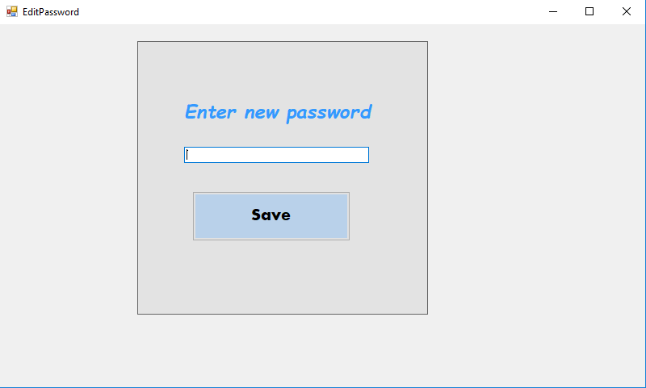
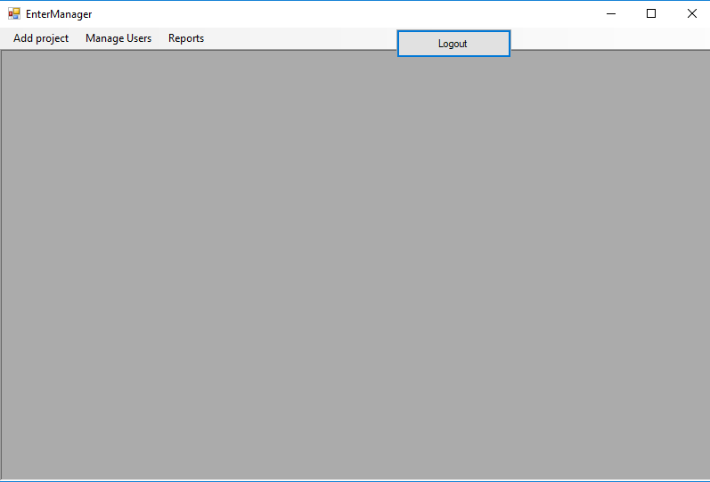
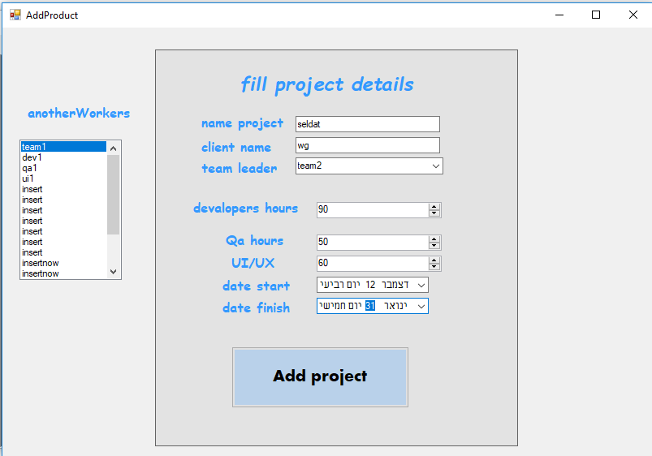
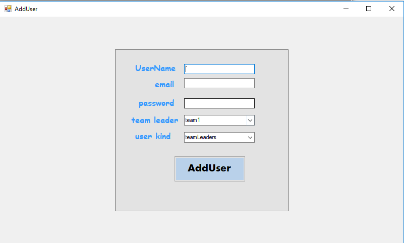
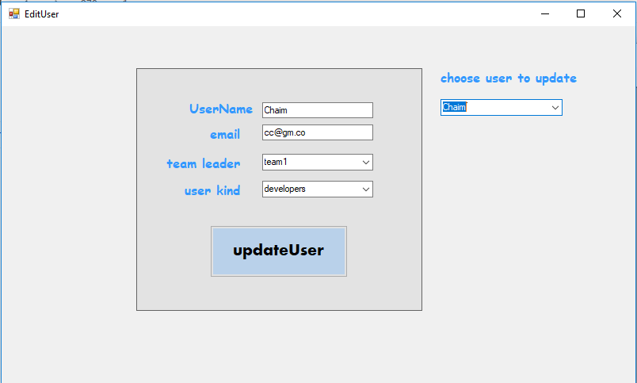
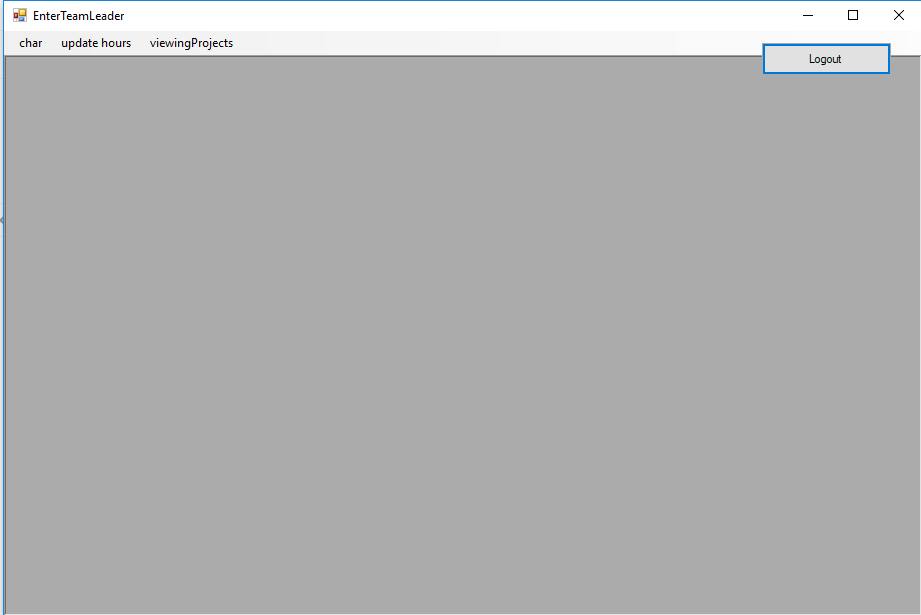
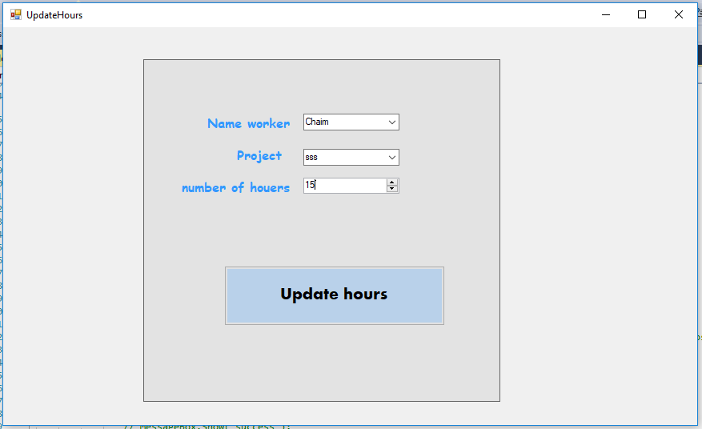
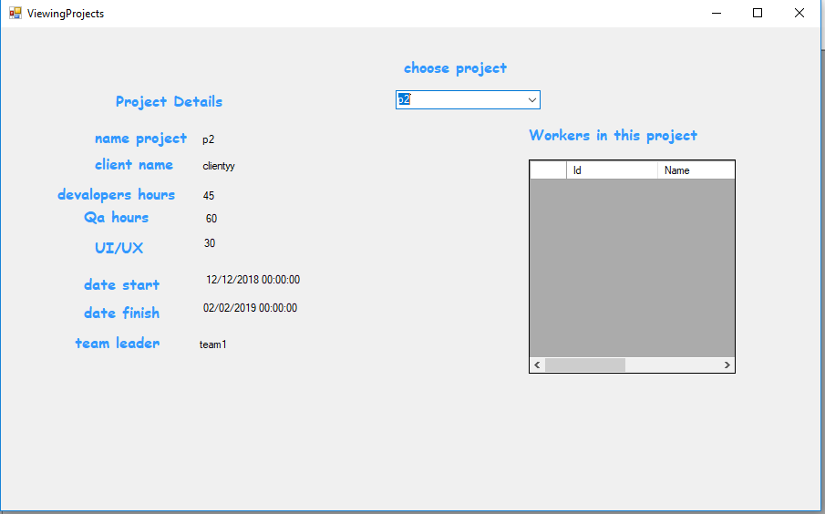
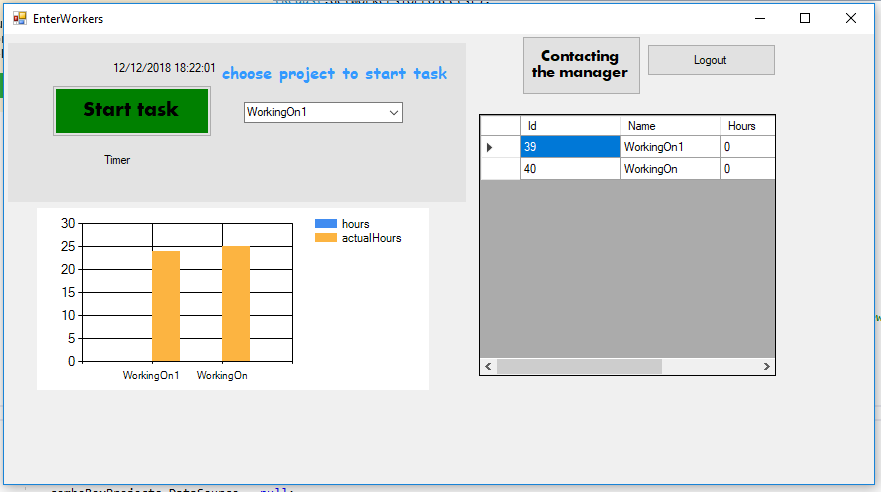

# Reporting-tasks-project
## Using this technologies:
* Web api
* My sql
* PHP
* WinForms
* Angular
## install the app:
  1. Run the `ReportingTasksProject` project.(the web api one)  This is the server.

  2.  Run the `php` server by 
        ```sh 
        shift+f6
        ```
        on the index.php page

  3. Run `ng serve` for a dev server, if you want to run the angular project. Navigate to `http://localhost:4200/`. 
      shoose which server you want to: the web api or the php one. 
      you can choose it in the `global` page
  4. Run the winform project  
  5. [Run the `mySql` code](https://github.com/tzviaEdelstein1/Reporting-tasks-project/blob/master/sqlScript.md) 

   * important thing in order to `send email` ip php platporm you have to change afew thing in the xampp files 
     in "C:\xampp\php\php.ini" find [mail function] and change 
     ```sh
       SMTP=smtp.gmail.com
       smtp_port=587
       sendmail_from = my-gmail-id@gmail.com
       sendmail_path = "\"C:\xampp\sendmail\sendmail.exe\" -t"
       ```
       now Open C:\xampp\sendmail\sendmail.ini. Replace all the existing code in sendmail.ini with following code
       ```sh
       [sendmail]   
       smtp_server=smtp.gmail.com
       smtp_port=587
       error_logfile=error.log
       debug_logfile=debug.log
       auth_username=my-gmail-id@gmail.com
       auth_password=my-gmail-password
       force_sender=my-gmail-id@gmail.com
       ```
       PS: don't forgot to replace my-gmail-id and my-gmail-password in above code.
       Also remember to restart the server using the XAMMP control panel so the changes take effect.
## Using libraries
   * in angular platform we use:
     * [primeng](https://www.primefaces.org/primeng/#/setup)
     * [bootsrap](https://getbootstrap.com/docs/3.3/getting-started/)
   * in winform platform we use:
     * [Teleric](https://docs.telerik.com/devtools/winforms/getting-started)  
***
## Web api
### Models
* User:
    * UserId - int, requiered,unique, identity
    * UserName - string - minLength: 2, maxLength:10, reqiered
    * UserEmail - string - pattern:email pattern, reqiered
    * Password - string -  minLength: 6, maxLength:10, reqiered
    * TeamLeaderId -int, optional
    * UserKindId-int,requiered
    *  UserIP- string,optional
    *  VerifyPassword- string,optional
* UserKind:
    * KindUserId - int, requiered,unique, identity
    * KindUserName - string, requiered,
 * Access:
    * AccessId - int, requiered,unique, identity
    * AccessName - string, reqiered
* UserKindToAccess:
    * UserKindToAccessId - int, requiered,unique, identity
    * userKindId - int, requiered
    * AccessId - int, requiered
* Projects:
    * ProjectId - int, requiered,unique, identity
    * ProjectName - string,reqiered
    * ClientName - string,reqiered
    * TeamLeaderId- int reqiered
    * DevelopersHours -int,reqiered
    * QaHours -int,reqiered
    * Ui/UxHours -int,reqiered 
    * StartDate -date,reqiered 
    * FinishDate -date,reqiered 
    * IsActive-boolean defult true
 * WorkerToProject:
    * WorkerToProjectId - int, requiered,unique, identity
    * UserId - int, requiered
    * ProjectId - int, requiered 
    * Hours - int, requiered 
 * ActualHours:
    * ActualHoursId - int, requiered,unique, identity
    * UserId - int, requiered
    * ProjectId - int, requiered 
    * CountHours - double, requiered 
    * date - date, requiered
*  Unknown:
   * Id -int,optional
   *  Name -string,requierd
   * Date-date optional
   * Hours -double
   * allocatedHours-double
* DetailsWorkerInProjects:
   * UserId-int 
   *   TeamLeaderName-string
   *   Name-string 
   *   Kind-string 
   *   Hours -int
   *   List<ActualHours> ActualHours-list of actualHours
* TreeTable:
   * Project-Project
   * DetailsWorkerInProjects- List<DetailsWorkerInProjects>  
### Controllers
* User controller:
    * Get -getAllUsers.
         We will return all the users from the db.
    * Get -GetUsersForTeamLeader.
      requierd data: 
         * TeamLeaderId 
         We will return all the matching users from the db.
    * Get -GetTeamLeaders.
         We will return all the matching users from the db.
     * Get -VerifyEmail.
      requierd data: 
         * userName 
         * password
         We will check if the user is exists with the same password if valid we will return the user,Else - we will return a matching error 
    * Get -VerifyPassword.
      requierd data: 
         * userName 
         We will check if the user is exists and send him an email
    * Post - Register.    
         requierd data: 
           * User
    If the user is valid - we will add him to the db, and return true, Else - we will return a matching error
    * Get - Login.
         requierd data: 
           * UserName 
           * Password 
     If the user whith the UserName and Password is exist in the db we will return the UserId object, Else - we will return not found.
    * Get - GetUserById.
         requierd data: 
           * UserId
    If there is in the db user with this UserId ,we will return the user object ,Else we will return not found.
    * Put - update user
         requierd data: 
         * User
     If there is in the db user object whith the same user_id and the new user object is valid - we will update the user in the db to this user, Else - we will return matching error.
    * Put - EditPassword
         requierd data: 
         * User
     If there is in the db user object whith the same user_id and the new user object is valid - we will update the user in the db to this user, Else - we will return matching error.
    * Put - CheckUserIp
         requierd data: 
         * Ip
     If there is in the db user object whith the same user_ip - we will return the user, Else - we will return matching error.
    * Delete - remove user
         requierd data: 
        * UserId
    If a user with this UserId is exist in the db - we will dellete him, Else we will return matching error.
    
   
* UserKind controller:
    * Get - get all the user kinds  
      We will return all the users kinds from the db.
* Access controller:
    * Get - get all the access
     We will return all the access from the db.

* AccessToUserKind controller:
    * Get - get access by UserKindId
        requierd data: 
        * UserKindId
    If the UserKindId is exist in the db - we will return all the access that belong to this user kind, Else - return matching error.

* Project controller:
    * Get - get all Projects
      We will return all the projects that exist in the db.
    * Get - Get Active Projects
      We will return all the matching projects
     * Get - GetProjectsByTeamId
       requierd data: 
         * TeamLeaderId 
      We will return all the matching projects
    * Get - GetProjectsByUserId
       requierd data: 
         * UserId 
      We will return all the matching projects
    * Get - GetProjectsAndHoursByUserId
       requierd data: 
         * UserId 
      We will return all the matching projects and the hours to this project
    * Get - GetProjectsAndHoursByUserIdAccordingTheMonth
       requierd data: 
         * UserId 
      We will return all the matching projects and the hours to this project
    * Get - GetProjectsAndHoursByTeamLeaderId
       requierd data: 
         * TeamId 
      We will return all the matching projects and the hours to this project
    * Post - add project    
         requierd data: 
        * Project
        * currentUserId
       If the user that his id equal to the currentUserId has the access to add new project, and the project id valid - we will add the new project to the db, Else - we will    return a matching error.

    * Put - update project
         requierd data: 
         * Project
         * currentUserId
         
    If the user that his id equal to the currentUserId has the accessto update  projects, and a project with the same id to the project date is found, we will update this project to the new project object, Else - we will return matching error.
    * Delete 
         requierd data: 
          * ProjectId
    If there is the db project with id that equals ProjectId - we will delete it from the db, Else - we will return matching error.
* Hours controller:
    
    * Post - add 
        requierd data: 
           * ActualHours (object)
     If the ActualHours object is valid, we will add it to the db, Else we will return matchig error.

* TreeTable controller:
  * Get - get all Tree Table
      We will return all the Tree Table that exist 
      this will return data for the reports.
* WorkerToProject controller:
    * Get - get projects by UserId
        requierd data: 
           * UserId
       We will return all the projects that belong to the User with id UserId or matching error.
    * Get - get workers by projectId
        requierd data: 
           * ProjectId
       We will return all the workers that belong to the project with id ProjectId or matching error.
    * Get - GetWorkerToProjectByPidAndUid
        requierd data: 
           * ProjectId
           * UserId
       We will return all the workers that belong to the project with id ProjectId and UserId or matching error.
    * Get - get all workers      
       We will return all the workers in the db.
    * Post - add new worker to project
        requierd data: 
           * WorkerToProject (object)
       If the WorkerToProject object is valid, we will add it to the db, Else we will return matchig error.
    * Put - updete details of worker to project record .
         requierd data: 
         * WorkerToProject
         * currentUserId
    If the user that his id equal to the currentUserId has the access to update  WorkerToProject records, and a WorkerToProject with the same id to the WorkerToProject id is found, we will update this WorkerToProject to the new WorkerToProject object, Else - we will return matching error.
    * Delete
        requierd data: 
        * WorkerToProjectId
        * currentUserId
    If the user that his id equal to the currentUserId has the access to delete  WorkerToProject records, and a WorkerToProject with the same id to the WorkerToProject id is found, we will delete this WorkerToProject from the db, Else - we will return matching error.
* SendEmail controller:
   * Get -send email   
***  


# Test api with `curl`

### Get Request
```
curl -X GET -v http://localhost:56028/api/getAllWorkers
```
```
Note: Unnecessary use of -X or --request, GET is already inferred.
*   Trying ::1...
* TCP_NODELAY set
* Connected to localhost (::1) port 56028 (#0)
> GET /api/getAllWorkers HTTP/1.1
> Host: localhost:56028
> User-Agent: curl/7.61.0
> Accept: */*
>
< HTTP/1.1 200 OK
< Cache-Control: no-cache
< Pragma: no-cache
< Content-Type: application/json; charset=utf-8
< Expires: -1
< Server: Microsoft-IIS/10.0
< X-AspNet-Version: 4.0.30319
< X-SourceFiles: =?UTF-8?B?QzpcVXNlcnNcc2VsZGF0XERvY3VtZW50c1xHaXRIdWJcVGFza01hb
mFnbWVudDJcVGFza01hbmFnbWVudFxVSUxcYXBpXGdldEFsbFdvcmtlcnM=?=
< X-Powered-By: ASP.NET
< Date: Thu, 29 Nov 2018 07:07:20 GMT
< Content-Length: 769
<
[{"Id":1,"Name":"manager","UserName":"mm","Password":"","JobId":1,"EMail":"manag
@gmail.com","ManagerId":null},{"Id":21,"Name":"TeamLeader","UserName":"tt","Pass
word":"","JobId":2,"EMail":"team@gmail.com","ManagerId":1},{"Id":22,"Name":"Work
er1","UserName":"ww1","Password":"","JobId":3,"EMail":"worker1@gmail.com","Manag
erId":21},{"Id":23,"Name":"Worker2","UserName":"ww2","Password":"","JobId":4,"EM
ail":"worker2@gmail.com","ManagerId":21},{"Id":24,"Name":"Worker3","UserName":"w
w3","Password":"","JobId":5,"EMail":"worker3@gmail.com","ManagerId":21},{"Id":25
,"Name":"Worker4","UserName":"ww4","Password":"","JobId":3,"EMail":"worker4@gmai
l.com","ManagerId":21},{"Id":27,"Name":"Gila","UserName":"gggg","Password":"","J
obId":4,"EMail":"safdsa@fdsa.fc","ManagerId":21}]* Connection #0 to host localho
st left intact
```
```
curl -X GET -v http://localhost:56028/api/GetPresence
```
```
Note: Unnecessary use of -X or --request, GET is already inferred.
*   Trying ::1...
* TCP_NODELAY set
* Connected to localhost (::1) port 56028 (#0)
> GET /api/GetPresence HTTP/1.1
> Host: localhost:56028
> User-Agent: curl/7.61.0
> Accept: */*
>
< HTTP/1.1 200 OK
< Cache-Control: no-cache
< Pragma: no-cache
< Content-Type: application/json; charset=utf-8
< Expires: -1
< Server: Microsoft-IIS/10.0
< X-AspNet-Version: 4.0.30319
< X-SourceFiles: =?UTF-8?B?QzpcVXNlcnNcc2VsZGF0XERvY3VtZW50c1xHaXRIdWJcVGFza01hb
mFnbWVudDJcVGFza01hbmFnbWVudFxVSUxcYXBpXEdldFByZXNlbmNl?=
< X-Powered-By: ASP.NET
< Date: Thu, 29 Nov 2018 07:08:57 GMT
< Content-Length: 5501
<
[{"WorkerName":"Worker1","ProjectName":"pr1","Date":"2018-11-27T00:00:00","Start
":"08:30:48","End":"15:28:56"},{"WorkerName":"Worker1","ProjectName":"pr1","Date
":"2018-11-28T00:00:00","Start":"11:23:50","End":"11:24:01"},{"WorkerName":"Work
er1","ProjectName":"pr2","Date":"2018-11-28T00:00:00","Start":"08:02:57","End":"
14:15:59"},{"WorkerName":"Worker1","ProjectName":"pr3","Date":"2018-11-29T00:00:
00","Start":"09:33:00","End":"17:45:01"},{"WorkerName":"Worker2","ProjectName":"
pr1","Date":"2018-11-28T00:00:00","Start":"10:29:11","End":"16:28:11"},{"WorkerN
ame":"Worker2","ProjectName":"pr2","Date":"2018-11-27T00:00:00","Start":"07:29:1
3","End":"16:46:15"},{"WorkerName":"Worker2","ProjectName":"pr3","Date":"2018-11
-29T00:00:00","Start":"08:09:16","End":"15:27:17"},{"WorkerName":"Worker3","Proj
ectName":"pr1","Date":"2018-11-29T00:00:00","Start":"08:15:29","End":"17:45:29"}
,{"WorkerName":"Worker3","ProjectName":"pr2","Date":"2018-11-28T00:00:00","Start
":"09:48:30","End":"13:06:31"},{"WorkerName":"Worker3","ProjectName":"pr3","Date
":"2018-11-27T00:00:00","Start":"10:29:32","End":"17:39:32"},{"WorkerName":"Work
er4","ProjectName":"pr1","Date":"2018-11-27T00:00:00","Start":"08:50:44","End":"
15:29:44"},{"WorkerName":"Worker4","ProjectName":"pr1","Date":"2018-11-27T00:00:
00","Start":"12:18:12","End":"12:18:19"},{"WorkerName":"Worker4","ProjectName":"
pr1","Date":"2018-11-27T00:00:00","Start":"14:23:45","End":"14:26:33"},{"WorkerN
ame":"Worker4","ProjectName":"pr1","Date":"2018-11-27T00:00:00","Start":"14:26:2
8","End":"14:26:33"},{"WorkerName":"Worker4","ProjectName":"pr1","Date":"2018-11
-27T00:00:00","Start":"14:26:43","End":"14:28:01"},{"WorkerName":"Worker4","Proj
ectName":"pr1","Date":"2018-11-27T00:00:00","Start":"14:27:36","End":"14:28:01"}
,{"WorkerName":"Worker4","ProjectName":"pr1","Date":"2018-11-27T00:00:00","Start
":"14:33:38","End":"14:33:50"},{"WorkerName":"Worker4","ProjectName":"pr1","Date
":"2018-11-27T00:00:00","Start":"14:34:21","End":"14:34:35"},{"WorkerName":"Work
er4","ProjectName":"pr1","Date":"2018-11-27T00:00:00","Start":"14:35:26","End":"
14:35:46"},{"WorkerName":"Worker4","ProjectName":"pr1","Date":"2018-11-27T00:00:
00","Start":"14:37:23","End":"14:37:27"},{"WorkerName":"Worker4","ProjectName":"
pr1","Date":"2018-11-27T00:00:00","Start":"14:37:42","End":"14:37:48"},{"WorkerN
ame":"Worker4","ProjectName":"pr1","Date":"2018-11-27T00:00:00","Start":"14:37:5
2","End":"14:38:01"},{"WorkerName":"Worker4","ProjectName":"pr1","Date":"2018-11
-28T00:00:00","Start":"08:37:41","End":"08:38:46"},{"WorkerName":"Worker4","Proj
ectName":"pr1","Date":"2018-11-28T00:00:00","Start":"08:39:03","End":"08:57:38"}
,{"WorkerName":"Worker4","ProjectName":"pr1","Date":"2018-11-28T00:00:00","Start
":"08:39:56","End":"08:57:38"},{"WorkerName":"Worker4","ProjectName":"pr1","Date
":"2018-11-28T00:00:00","Start":"08:41:00","End":"08:57:38"},{"WorkerName":"Work
er4","ProjectName":"pr1","Date":"2018-11-28T00:00:00","Start":"08:43:27","End":"
08:57:38"},{"WorkerName":"Worker4","ProjectName":"pr1","Date":"2018-11-28T00:00:
00","Start":"08:44:23","End":"08:57:38"},{"WorkerName":"Worker4","ProjectName":"
pr1","Date":"2018-11-28T00:00:00","Start":"08:57:32","End":"08:57:38"},{"WorkerN
ame":"Worker4","ProjectName":"pr1","Date":"2018-11-28T00:00:00","Start":"08:57:4
2","End":"08:57:48"},{"WorkerName":"Worker4","ProjectName":"pr1","Date":"2018-11
-28T00:00:00","Start":"08:57:49","End":"09:05:02"},{"WorkerName":"Worker4","Proj
ectName":"pr1","Date":"2018-11-28T00:00:00","Start":"08:58:14","End":"09:05:02"}
,{"WorkerName":"Worker4","ProjectName":"pr1","Date":"2018-11-28T00:00:00","Start
":"09:04:57","End":"09:05:02"},{"WorkerName":"Worker4","ProjectName":"pr1","Date
":"2018-11-28T00:00:00","Start":"09:05:14","End":"09:16:08"},{"WorkerName":"Work
er4","ProjectName":"pr1","Date":"2018-11-28T00:00:00","Start":"09:05:36","End":"
09:16:08"},{"WorkerName":"Worker4","ProjectName":"pr1","Date":"2018-11-28T00:00:
00","Start":"09:15:47","End":"09:16:08"},{"WorkerName":"Worker4","ProjectName":"
pr1","Date":"2018-11-28T00:00:00","Start":"09:16:53","End":"09:17:05"},{"WorkerN
ame":"Worker4","ProjectName":"pr1","Date":"2018-11-28T00:00:00","Start":"09:19:2
0","End":"09:19:26"},{"WorkerName":"Worker4","ProjectName":"pr1","Date":"2018-11
-28T00:00:00","Start":"09:19:41","End":"09:19:52"},{"WorkerName":"Worker4","Proj
ectName":"pr1","Date":"2018-11-28T00:00:00","Start":"09:20:04","End":"09:20:09"}
,{"WorkerName":"Worker4","ProjectName":"pr1","Date":"2018-11-28T00:00:00","Start
":"09:25:11","End":"09:25:20"},{"WorkerName":"Worker4","ProjectName":"pr1","Date
":"2018-11-28T00:00:00","Start":"09:25:25","End":"09:25:26"},{"WorkerName":"Work
er4","ProjectName":"pr2","Date":"2018-11-28T00:00:00","Start":"09:12:45","End":"
14:59:48"},{"WorkerName":"Worker4","ProjectName":"pr2","Date":"2018-11-28T00:00:
00","Start":"09:20:37","End":"09:20:47"},{"WorkerName":"Worker4","ProjectName":"
pr2","Date":"2018-11-28T00:00:00","Start":"09:22:03","End":"09:22:12"},{"WorkerN
ame":"Worker4","ProjectName":"pr2","Date":"2018-11-28T00:00:00","Start":"09:22:2
3","End":"09:22:29"},{"WorkerName":"Worker4","ProjectName":"pr2","Date":"2018-11
-28T00:00:00","Start":"09:23:48","End":"09:23:53"},{"WorkerName":"Worker4","Proj
ectName":"pr2","Date":"2018-11-28T00:00:00","Start":"09:24:00","End":"09:24:03"}
,{"WorkerName":"Worker4","ProjectName":"pr3","Date":"2018-11-29T00:00:00","Start
":"10:03:50","End":"15:49:53"},{"WorkerName":"Worker4","ProjectName":"pr3","Date
":"2018-11-30T00:00:00","Start":"07:29:54","End":"15:29:57"}]* Connection #0 to
host localhost left intact
```
```
curl -X GET -v http://localhost:56028/api/getAllManagers
```
```
Note: Unnecessary use of -X or --request, GET is already inferred.
*   Trying ::1...
* TCP_NODELAY set
* Connected to localhost (::1) port 56028 (#0)
> GET /api/getAllManagers HTTP/1.1
> Host: localhost:56028
> User-Agent: curl/7.61.0
> Accept: */*
>
< HTTP/1.1 200 OK
< Cache-Control: no-cache
< Pragma: no-cache
< Content-Type: application/json; charset=utf-8
< Expires: -1
< Server: Microsoft-IIS/10.0
< X-AspNet-Version: 4.0.30319
< X-SourceFiles: =?UTF-8?B?QzpcVXNlcnNcc2VsZGF0XERvY3VtZW50c1xHaXRIdWJcVGFza01hb
mFnbWVudDJcVGFza01hbmFnbWVudFxVSUxcYXBpXGdldEFsbE1hbmFnZXJz?=
< X-Powered-By: ASP.NET
< Date: Thu, 29 Nov 2018 07:11:39 GMT
< Content-Length: 219
<
[{"Id":1,"Name":"manager","UserName":"mm","Password":"","JobId":1,"EMail":"manag
@gmail.com","ManagerId":null},{"Id":21,"Name":"TeamLeader","UserName":"tt","Pass
word":"","JobId":2,"EMail":"team@gmail.com","ManagerId":1}]* Connection #0 to ho
st localhost left intact
```
```
curl -X GET -v http://localhost:56028/api/getProjectDeatails/21
```
```
Note: Unnecessary use of -X or --request, GET is already inferred.
*   Trying ::1...
* TCP_NODELAY set
* Connected to localhost (::1) port 56028 (#0)
> GET /api/getProjectDeatails/21 HTTP/1.1
> Host: localhost:56028
> User-Agent: curl/7.61.0
> Accept: */*
>
< HTTP/1.1 200 OK
< Cache-Control: no-cache
< Pragma: no-cache
< Content-Type: application/json; charset=utf-8
< Expires: -1
< Server: Microsoft-IIS/10.0
< X-AspNet-Version: 4.0.30319
< X-SourceFiles: =?UTF-8?B?QzpcVXNlcnNcc2VsZGF0XERvY3VtZW50c1xHaXRIdWJcVGFza01hb
mFnbWVudDJcVGFza01hbmFnbWVudFxVSUxcYXBpXGdldFByb2plY3REZWF0YWlsc1wyMQ==?=
< X-Powered-By: ASP.NET
< Date: Thu, 29 Nov 2018 07:13:21 GMT
< Content-Length: 686
<
[{"Id":7,"Name":"pr1","TeamLeaderId":21,"Customer":"aaa","DevelopHours":280,"QAH
ours":130,"UiUxHours":45,"StartDate":"2018-11-27T00:00:00","EndDate":"2019-01-26
T00:00:00"},{"Id":8,"Name":"pr2","TeamLeaderId":21,"Customer":"aaa","DevelopHour
s":480,"QAHours":56,"UiUxHours":210,"StartDate":"2018-12-12T00:00:00","EndDate":
"2019-03-30T00:00:00"},{"Id":9,"Name":"pr3","TeamLeaderId":21,"Customer":"ddd","
DevelopHours":250,"QAHours":45,"UiUxHours":67,"StartDate":"2018-11-30T00:00:00",
"EndDate":"2019-10-26T00:00:00"},{"Id":10,"Name":"tr1","TeamLeaderId":21,"Custom
er":"nnn","DevelopHours":300,"QAHours":250,"UiUxHours":100,"StartDate":"2018-02-
02T00:00:00","EndDate":"2018-07-07T00:00:00"}]* Connection #0 to host localhost
left intact
```
```
curl -X GET -v http://localhost:56028/api/getWorkersDeatails/21
```
```
Note: Unnecessary use of -X or --request, GET is already inferred.
*   Trying ::1...
* TCP_NODELAY set
* Connected to localhost (::1) port 56028 (#0)
> GET /api/getWorkersDeatails/21 HTTP/1.1
> Host: localhost:56028
> User-Agent: curl/7.61.0
> Accept: */*
>
< HTTP/1.1 200 OK
< Cache-Control: no-cache
< Pragma: no-cache
< Content-Type: application/json; charset=utf-8
< Expires: -1
< Server: Microsoft-IIS/10.0
< X-AspNet-Version: 4.0.30319
< X-SourceFiles: =?UTF-8?B?QzpcVXNlcnNcc2VsZGF0XERvY3VtZW50c1xHaXRIdWJcVGFza01hb
mFnbWVudDJcVGFza01hbmFnbWVudFxVSUxcYXBpXGdldFdvcmtlcnNEZWF0YWlsc1wyMQ==?=
< X-Powered-By: ASP.NET
< Date: Thu, 29 Nov 2018 07:14:36 GMT
< Content-Length: 551
<
[{"Id":22,"Name":"Worker1","UserName":"ww1","Password":"","JobId":3,"EMail":"wor
ker1@gmail.com","ManagerId":21},{"Id":23,"Name":"Worker2","UserName":"ww2","Pass
word":"","JobId":4,"EMail":"worker2@gmail.com","ManagerId":21},{"Id":24,"Name":"
Worker3","UserName":"ww3","Password":"","JobId":5,"EMail":"worker3@gmail.com","M
anagerId":21},{"Id":25,"Name":"Worker4","UserName":"ww4","Password":"","JobId":3
,"EMail":"worker4@gmail.com","ManagerId":21},{"Id":27,"Name":"Gila","UserName":"
gggg","Password":"","JobId":4,"EMail":"safdsa@fdsa.fc","ManagerId":21}]* Connect
ion #0 to host localhost left intact
```
```
curl -X GET -v http://localhost:56028/api/getWorkersHours/7
```
```
Note: Unnecessary use of -X or --request, GET is already inferred.
*   Trying ::1...
* TCP_NODELAY set
* Connected to localhost (::1) port 56028 (#0)
> GET /api/getWorkersHours/7 HTTP/1.1
> Host: localhost:56028
> User-Agent: curl/7.61.0
> Accept: */*
>
< HTTP/1.1 200 OK
< Cache-Control: no-cache
< Pragma: no-cache
< Content-Type: application/json; charset=utf-8
< Expires: -1
< Server: Microsoft-IIS/10.0
< X-AspNet-Version: 4.0.30319
< X-SourceFiles: =?UTF-8?B?QzpcVXNlcnNcc2VsZGF0XERvY3VtZW50c1xHaXRIdWJcVGFza01hb
mFnbWVudDJcVGFza01hbmFnbWVudFxVSUxcYXBpXGdldFdvcmtlcnNIb3Vyc1w3?=
< X-Powered-By: ASP.NET
< Date: Thu, 29 Nov 2018 07:16:51 GMT
< Content-Length: 275
<
[{"Name":"Gila","Hours":"0:0","AllocatedHours":0.0},{"Name":"Worker1","Hours":"6
:58","AllocatedHours":25.0},{"Name":"Worker2","Hours":"5:59","AllocatedHours":46
.0},{"Name":"Worker3","Hours":"9:30","AllocatedHours":70.0},{"Name":"Worker4","H
ours":"8:43","AllocatedHours":6.4}]* Connection #0 to host localhost left intact
```
```
curl -X GET -v http://localhost:56028/api/getWorkerHours/21/22
```
```
Note: Unnecessary use of -X or --request, GET is already inferred.
*   Trying ::1...
* TCP_NODELAY set
* Connected to localhost (::1) port 56028 (#0)
> GET /api/getWorkerHours/21/22 HTTP/1.1
> Host: localhost:56028
> User-Agent: curl/7.61.0
> Accept: */*
>
< HTTP/1.1 200 OK
< Cache-Control: no-cache
< Pragma: no-cache
< Content-Type: application/json; charset=utf-8
< Expires: -1
< Server: Microsoft-IIS/10.0
< X-AspNet-Version: 4.0.30319
< X-SourceFiles: =?UTF-8?B?QzpcVXNlcnNcc2VsZGF0XERvY3VtZW50c1xHaXRIdWJcVGFza01hb
mFnbWVudDJcVGFza01hbmFnbWVudFxVSUxcYXBpXGdldFdvcmtlckhvdXJzXDIxXDIy?=
< X-Powered-By: ASP.NET
< Date: Thu, 29 Nov 2018 07:18:19 GMT
< Content-Length: 248
<
[{"Id":48,"Name":"pr1","AllocatedHours":25.0,"Hours":"06:58:19"},{"Id":52,"Name"
:"pr2","AllocatedHours":30.0,"Hours":"06:13:02"},{"Id":56,"Name":"pr3","Allocate
dHours":18.0,"Hours":"08:12:01"},{"Id":60,"Name":"tr1","AllocatedHours":0.0,"Hou
rs":""}]* Connection #0 to host localhost left intact
```
```
curl -X GET -v http://localhost:56028/api/getWorkerDetails/22
```
```
Note: Unnecessary use of -X or --request, GET is already inferred.
*   Trying ::1...
* TCP_NODELAY set
* Connected to localhost (::1) port 56028 (#0)
> GET /api/getWorkerDetails/22 HTTP/1.1
> Host: localhost:56028
> User-Agent: curl/7.61.0
> Accept: */*
>
< HTTP/1.1 200 OK
< Cache-Control: no-cache
< Pragma: no-cache
< Content-Type: application/json; charset=utf-8
< Expires: -1
< Server: Microsoft-IIS/10.0
< X-AspNet-Version: 4.0.30319
< X-SourceFiles: =?UTF-8?B?QzpcVXNlcnNcc2VsZGF0XERvY3VtZW50c1xHaXRIdWJcVGFza01hb
mFnbWVudDJcVGFza01hbmFnbWVudFxVSUxcYXBpXGdldFdvcmtlckRldGFpbHNcMjI=?=
< X-Powered-By: ASP.NET
< Date: Thu, 29 Nov 2018 07:20:40 GMT
< Content-Length: 110
<
{"Id":22,"Name":"Worker1","UserName":"ww1","Password":"","JobId":3,"EMail":"work
er1@gmail.com","ManagerId":21}* Connection #0 to host localhost left intact
```
```
curl -X GET -v http://localhost:56028/api/getProject/7
```
```
Note: Unnecessary use of -X or --request, GET is already inferred.
*   Trying ::1...
* TCP_NODELAY set
* Connected to localhost (::1) port 56028 (#0)
> GET /api/getProject/7 HTTP/1.1
> Host: localhost:56028
> User-Agent: curl/7.61.0
> Accept: */*
>
< HTTP/1.1 200 OK
< Cache-Control: no-cache
< Pragma: no-cache
< Content-Type: application/json; charset=utf-8
< Expires: -1
< Server: Microsoft-IIS/10.0
< X-AspNet-Version: 4.0.30319
< X-SourceFiles: =?UTF-8?B?QzpcVXNlcnNcc2VsZGF0XERvY3VtZW50c1xHaXRIdWJcVGFza01hb
mFnbWVudDJcVGFza01hbmFnbWVudFxVSUxcYXBpXGdldFByb2plY3RcNw==?=
< X-Powered-By: ASP.NET
< Date: Thu, 29 Nov 2018 07:21:56 GMT
< Content-Length: 2
<
[]* Connection #0 to host localhost left intact
```
### Put Request (not valid data)
```
curl -v -X PUT -H "Content-type: application/json" -d "{\"Id\":\"7\",\"Name\":\"Malki\", \"UserName\":\"ggggg\",\"Password\":\"mmmggg\" , \"JobId\":\"3\",\"EMail\":\"sjafjkl@df.vaf\", \"ManagerId\":\"21\"}"  http://localhost:56028/api/UpdateWorker
```
```
*   Trying ::1...
* TCP_NODELAY set
* Connected to localhost (::1) port 56028 (#0)
> PUT /api/UpdateWorker HTTP/1.1
> Host: localhost:56028
> User-Agent: curl/7.61.0
> Accept: */*
> Content-type: application/json
> Content-Length: 122
>
* upload completely sent off: 122 out of 122 bytes
< HTTP/1.1 400 Bad Request
< Cache-Control: no-cache
< Pragma: no-cache
< Content-Type: application/json; charset=utf-8
< Expires: -1
< Server: Microsoft-IIS/10.0
< X-AspNet-Version: 4.0.30319
< X-SourceFiles: =?UTF-8?B?QzpcVXNlcnNcc2VsZGF0XERvY3VtZW50c1xHaXRIdWJcVGFza01hb
mFnbWVudDJcVGFza01hbmFnbWVudFxVSUxcYXBpXFVwZGF0ZVdvcmtlcg==?=
< X-Powered-By: ASP.NET
< Date: Thu, 29 Nov 2018 07:31:54 GMT
< Content-Length: 22
<
"Can not update in DB"* Connection #0 to host localhost left intact
```
```
curl -v -X PUT -H "Content-type: application/json" -d "{\"projectWorkerId\":\"1\",\"numHours\":\"30\"}"  http://localhost:56028/api/updateWorkerHours
```
```
*   Trying ::1...
* TCP_NODELAY set
* Connected to localhost (::1) port 56028 (#0)
> PUT /api/updateWorkerHours HTTP/1.1
> Host: localhost:56028
> User-Agent: curl/7.61.0
> Accept: */*
> Content-type: application/json
> Content-Length: 39
>
* upload completely sent off: 39 out of 39 bytes
< HTTP/1.1 400 Bad Request
< Cache-Control: no-cache
< Pragma: no-cache
< Content-Type: application/json; charset=utf-8
< Expires: -1
< Server: Microsoft-IIS/10.0
< X-AspNet-Version: 4.0.30319
< X-SourceFiles: =?UTF-8?B?QzpcVXNlcnNcc2VsZGF0XERvY3VtZW50c1xHaXRIdWJcVGFza01hb
mFnbWVudDJcVGFza01hbmFnbWVudFxVSUxcYXBpXHVwZGF0ZVdvcmtlckhvdXJz?=
< X-Powered-By: ASP.NET
< Date: Thu, 29 Nov 2018 07:38:47 GMT
< Content-Length: 29
<
"Can not update in Data Base"* Connection #0 to host localhost left intact
```
### Put Request (valid data)
```
curl -v -X PUT -H "Content-type: application/json" -d "{\"Id\":\"27\",\"Name\":\"Malki\", \"UserName\":\"1ggg\",\"Password\":\"mmmggg\" , \"JobId\":\"3\",\"EMail\":\"sjafjkl@df.vaf\", \"ManagerId\":\"21\"}"  http://localhost:56028/api/UpdateWorker
```
```
*   Trying ::1...
* TCP_NODELAY set
* Connected to localhost (::1) port 56028 (#0)
> PUT /api/UpdateWorker HTTP/1.1
> Host: localhost:56028
> User-Agent: curl/7.61.0
> Accept: */*
> Content-type: application/json
> Content-Length: 122
>
* upload completely sent off: 122 out of 122 bytes
< HTTP/1.1 200 OK
< Cache-Control: no-cache
< Pragma: no-cache
< Expires: -1
< Server: Microsoft-IIS/10.0
< X-AspNet-Version: 4.0.30319
< X-SourceFiles: =?UTF-8?B?QzpcVXNlcnNcc2VsZGF0XERvY3VtZW50c1xHaXRIdWJcVGFza01hb
mFnbWVudDJcVGFza01hbmFnbWVudFxVSUxcYXBpXFVwZGF0ZVdvcmtlcg==?=
< X-Powered-By: ASP.NET
< Date: Thu, 29 Nov 2018 07:36:40 GMT
< Content-Length: 0
<
* Connection #0 to host localhost left intact
```
```
curl -v -X PUT -H "Content-type: application/json" -d "{\"projectWorkerId\":\"48\",\"numHours\":\"30\"}"  http://localhost:56028/api/updateWorkerHours
```
```
*   Trying ::1...
* TCP_NODELAY set
* Connected to localhost (::1) port 56028 (#0)
> PUT /api/updateWorkerHours HTTP/1.1
> Host: localhost:56028
> User-Agent: curl/7.61.0
> Accept: */*
> Content-type: application/json
> Content-Length: 40
>
* upload completely sent off: 40 out of 40 bytes
< HTTP/1.1 200 OK
< Cache-Control: no-cache
< Pragma: no-cache
< Expires: -1
< Server: Microsoft-IIS/10.0
< X-AspNet-Version: 4.0.30319
< X-SourceFiles: =?UTF-8?B?QzpcVXNlcnNcc2VsZGF0XERvY3VtZW50c1xHaXRIdWJcVGFza01hb
mFnbWVudDJcVGFza01hbmFnbWVudFxVSUxcYXBpXHVwZGF0ZVdvcmtlckhvdXJz?=
< X-Powered-By: ASP.NET
< Date: Thu, 29 Nov 2018 07:40:00 GMT
< Content-Length: 0
<
* Connection #0 to host localhost left intact
```

### Post Request (not valid data)
```
curl -v -X POST -H "Content-type: application/json" -d "{\"UserName\":\"DDD\", \"Password\":\"444444\"}"  http://localhost:56028/api/login
```
```
Note: Unnecessary use of -X or --request, POST is already inferred.
*   Trying ::1...
* TCP_NODELAY set
* Connected to localhost (::1) port 56028 (#0)
> POST /api/login HTTP/1.1
> Host: localhost:56028
> User-Agent: curl/7.61.0
> Accept: */*
> Content-type: application/json
> Content-Length: 39
>
* upload completely sent off: 39 out of 39 bytes
< HTTP/1.1 400 Bad Request
< Cache-Control: no-cache
< Pragma: no-cache
< Content-Type: application/json; charset=utf-8
< Expires: -1
< Server: Microsoft-IIS/10.0
< X-AspNet-Version: 4.0.30319
< X-SourceFiles: =?UTF-8?B?QzpcVXNlcnNcc2VsZGF0XERvY3VtZW50c1xHaXRIdWJcVGFza01hb
mFnbWVudDJcVGFza01hbmFnbWVudFxVSUxcYXBpXGxvZ2lu?=
< X-Powered-By: ASP.NET
< Date: Wed, 28 Nov 2018 09:50:14 GMT
< Content-Length: 16
<
"Can not log in"* Connection #0 to host localhost left intact
```
```
curl -v -X POST -H "Content-type: application/json" -d "{\"Name\":\"tryProject\", \"Customer\":\"nnn\",\"TeamLeaderId\":\"11\" , \"DevelopHours\":\"300\",\"QAHours\":\"250\", \"UiUxHours\":\"100\",\"StartDate\":\"2018-02-02\",\"EndDate\":\"2018-07-07\"}"  http://localhost:56028/api/addProject
```
```
Note: Unnecessary use of -X or --request, POST is already inferred.
*   Trying ::1...
* TCP_NODELAY set
*   Trying 127.0.0.1...
* TCP_NODELAY set
* connect to ::1 port 56028 failed: Connection refused
* connect to 127.0.0.1 port 56028 failed: Connection refused
* Failed to connect to localhost port 56028: Connection refused
* Closing connection 0
curl: (7) Failed to connect to localhost port 56028: Connection refused
```
```
curl -v -X POST -H "Content-type: application/json" -d "{\"Name\":\"Gila\",\"UserName\":\"gggg\",\
"Password\":\"gggggg\",\"JobId\":\"4\",\"EMail\":\"safdsa@fdsaf\",\"ManagerId\":\"11\"}"  http://localhost:56028/api/addWorker
```
```
Note: Unnecessary use of -X or --request, POST is already inferred.
*   Trying ::1...
* TCP_NODELAY set
* Connected to localhost (::1) port 56028 (#0)
> POST /api/addWorker HTTP/1.1
> Host: localhost:56028
> User-Agent: curl/7.61.0
> Accept: */*
> Content-type: application/json
> Content-Length: 105
>
* upload completely sent off: 105 out of 105 bytes
< HTTP/1.1 400 Bad Request
< Cache-Control: no-cache
< Pragma: no-cache
< Content-Type: application/json; charset=utf-8
< Expires: -1
< Server: Microsoft-IIS/10.0
< X-AspNet-Version: 4.0.30319
< X-SourceFiles: =?UTF-8?B?QzpcVXNlcnNcc2VsZGF0XERvY3VtZW50c1xHaXRIdWJcVGFza01hb
mFnbWVudDJcVGFza01hbmFnbWVudFxVSUxcYXBpXGFkZFdvcmtlcg==?=
< X-Powered-By: ASP.NET
< Date: Thu, 29 Nov 2018 06:42:53 GMT
< Content-Length: 19
<
"Can not add to DB"* Connection #0 to host localhost left intact
```
```
curl -v -X POST -H "Content-type: application/json" -d "{\"idProjectWorker\":\"7\",\"hour\":\"8\","isFirst\":\"true\"}"  http://localhost:56028/api/updateStartHour
```
```
Note: Unnecessary use of -X or --request, POST is already inferred.
*   Trying ::1...
* TCP_NODELAY set
* Connected to localhost (::1) port 56028 (#0)
> POST /api/updateHours HTTP/1.1
> Host: localhost:56028
> User-Agent: curl/7.61.0
> Accept: */*
> Content-type: application/json
> Content-Length: 21
>
* upload completely sent off: 21 out of 21 bytes
< HTTP/1.1 404 Not Found
< Cache-Control: no-cache
< Pragma: no-cache
< Content-Type: application/json; charset=utf-8
< Expires: -1
< Server: Microsoft-IIS/10.0
< X-AspNet-Version: 4.0.30319
< X-SourceFiles: =?UTF-8?B?QzpcVXNlcnNcc2VsZGF0XERvY3VtZW50c1xHaXRIdWJcVGFza01hb
mFnbWVudDJcVGFza01hbmFnbWVudFxVSUxcYXBpXHVwZGF0ZUhvdXJz?=
< X-Powered-By: ASP.NET
< Date: Thu, 29 Nov 2018 06:48:36 GMT
< Content-Length: 196
<
{"Message":"No HTTP resource was found that matches the request URI 'http://loca
lhost:56028/api/updateHours'.","MessageDetail":"No type was found that matches t
he controller named 'updateHours'."}* Connection #0 to host localhost left intact
```
```
curl -v -X POST -H "Content-type: application/json" -d "{\"sub\":\"malky8895\",\"body\":\"ddd\",\"id\":\"9\"}"  http://localhost:56028/api/SendMsg
```
```
Note: Unnecessary use of -X or --request, POST is already inferred.
*   Trying ::1...
* TCP_NODELAY set
* Connected to localhost (::1) port 56028 (#0)
> POST /api/SendMsg HTTP/1.1
> Host: localhost:56028
> User-Agent: curl/7.61.0
> Accept: */*
> Content-type: application/json
> Content-Length: 41
>
* upload completely sent off: 41 out of 41 bytes
< HTTP/1.1 500 Internal Server Error
< Cache-Control: no-cache
< Pragma: no-cache
< Content-Type: application/json; charset=utf-8
< Expires: -1
< Server: Microsoft-IIS/10.0
< X-AspNet-Version: 4.0.30319
< X-SourceFiles: =?UTF-8?B?QzpcVXNlcnNcc2VsZGF0XERvY3VtZW50c1xHaXRIdWJcVGFza01hb
mFnbWVudDJcVGFza01hbmFnbWVudFxVSUxcYXBpXFNlbmRNc2c=?=
< X-Powered-By: ASP.NET
< Date: Thu, 29 Nov 2018 07:04:54 GMT
< Content-Length: 2634
```

### Post Request (valid data)
```
curl-7.61.0-win64-mingw\bin>curl -v -X POST -H "Content-type: application/json" -d "{\"UserName\":\"mm\", \"Password\":\"6773ea887f0e3f1c34b01936aaf9687b16a04c6f9e65e4afbfce7bb7f76b0857\"}"  http://localhost:56028/api/login
```
```
Note: Unnecessary use of -X or --request, POST is already inferred.
*   Trying ::1...
* TCP_NODELAY set
* Connected to localhost (::1) port 56028 (#0)
> POST /api/login HTTP/1.1
> Host: localhost:56028
> User-Agent: curl/7.61.0
> Accept: */*
> Content-type: application/json
> Content-Length: 96
>
* upload completely sent off: 96 out of 96 bytes
< HTTP/1.1 200 OK
< Cache-Control: no-cache
< Pragma: no-cache
< Content-Type: application/json; charset=utf-8
< Expires: -1
< Server: Microsoft-IIS/10.0
< X-AspNet-Version: 4.0.30319
< X-SourceFiles: =?UTF-8?B?QzpcVXNlcnNcc2VsZGF0XERvY3VtZW50c1xHaXRIdWJcVGFza01hb
mFnbWVudDJcVGFza01hbmFnbWVudFxVSUxcYXBpXGxvZ2lu?=
< X-Powered-By: ASP.NET
< Date: Wed, 28 Nov 2018 09:55:38 GMT
< Content-Length: 108
<
{"Id":1,"Name":"manager","UserName":"mm","Password":"","JobId":1,"EMail":"manag@
gmail.com","ManagerId":null}* Connection #0 to host localhost left intact
```
```
C:\Users\administrator.NB\Desktop\curl-7.61.0-win64-mingw\bin>curl -v -X POST -H
 "Content-type: application/json" -d "{\"Name\":\"tr1\", \"Customer\":\"nnn\",\"TeamLeaderId\":\"21\" 
 , \"DevelopHours\":\"300\",\"QAHours\":\"250\", \"UiUxHours\":\"100\",\"StartDate\":\"2018-02-02\",\"EndDate\":\"2018-07-07\"}"  http://localhost:56028/api/addProject
```
```
Note: Unnecessary use of -X or --request, POST is already inferred.
*   Trying ::1...
* TCP_NODELAY set
* Connected to localhost (::1) port 56028 (#0)
> POST /api/addProject HTTP/1.1
> Host: localhost:56028
> User-Agent: curl/7.61.0
> Accept: */*
> Content-type: application/json
> Content-Length: 158
>
* upload completely sent off: 158 out of 158 bytes
< HTTP/1.1 201 Created
< Cache-Control: no-cache
< Pragma: no-cache
< Expires: -1
< Server: Microsoft-IIS/10.0
< X-AspNet-Version: 4.0.30319
< X-SourceFiles: =?UTF-8?B?QzpcVXNlcnNcc2VsZGF0XERvY3VtZW50c1xHaXRIdWJcVGFza01hb
mFnbWVudDJcVGFza01hbmFnbWVudFxVSUxcYXBpXGFkZFByb2plY3Q=?=
< X-Powered-By: ASP.NET
< Date: Thu, 29 Nov 2018 06:40:12 GMT
< Content-Length: 0
<
* Connection #0 to host localhost left intact
```
```
C:\Users\administrator.NB\Desktop\curl-7.61.0-win64-mingw\bin>curl -v -X POST -H "Content-type: application/json" -d "{\"Name\":\"Gila\",\"UserName\":\"gggg\",\
"Password\":\"gggggg\",\"JobId\":\"4\",\"EMail\":\"safdsa@fdsa.fc\",\"ManagerId\":\"21\"}"  http://localhost:56028/api/addWorker
```
```
Note: Unnecessary use of -X or --request, POST is already inferred.
*   Trying ::1...
* TCP_NODELAY set
* Connected to localhost (::1) port 56028 (#0)
> POST /api/addWorker HTTP/1.1
> Host: localhost:56028
> User-Agent: curl/7.61.0
> Accept: */*
> Content-type: application/json
> Content-Length: 107
>
* upload completely sent off: 107 out of 107 bytes
< HTTP/1.1 201 Created
< Cache-Control: no-cache
< Pragma: no-cache
< Expires: -1
< Server: Microsoft-IIS/10.0
< X-AspNet-Version: 4.0.30319
< X-SourceFiles: =?UTF-8?B?QzpcVXNlcnNcc2VsZGF0XERvY3VtZW50c1xHaXRIdWJcVGFza01hb
mFnbWVudDJcVGFza01hbmFnbWVudFxVSUxcYXBpXGFkZFdvcmtlcg==?=
< X-Powered-By: ASP.NET
< Date: Thu, 29 Nov 2018 06:46:11 GMT
< Content-Length: 0
<
* Connection #0 to host localhost left intact
```
```
curl -v -X POST -H "Content-type: application/json" -d "{\"idProjectWorker\":\"22\",\"hour\":\"8\","isFirst\":\"true\"}"  http://localhost:56028/api/updateStartHour
```
```
```
```
curl -v -X POST -H "Content-type: application/json" -d "{\"sub\":\"malky8895\",\"body\":\"ddd\",\"id\":\"22\"}"  http://localhost:56028/api/SendMsg
```
```
Note: Unnecessary use of -X or --request, POST is already inferred.
*   Trying ::1...
* TCP_NODELAY set
* Connected to localhost (::1) port 56028 (#0)
> POST /api/SendMsg HTTP/1.1
> Host: localhost:56028
> User-Agent: curl/7.61.0
> Accept: */*
> Content-type: application/json
> Content-Length: 42
>
* upload completely sent off: 42 out of 42 bytes
< HTTP/1.1 200 OK
< Cache-Control: no-cache
< Pragma: no-cache
< Expires: -1
< Server: Microsoft-IIS/10.0
< X-AspNet-Version: 4.0.30319
< X-SourceFiles: =?UTF-8?B?QzpcVXNlcnNcc2VsZGF0XERvY3VtZW50c1xHaXRIdWJcVGFza01hb
mFnbWVudDJcVGFza01hbmFnbWVudFxVSUxcYXBpXFNlbmRNc2c=?=
< X-Powered-By: ASP.NET
< Date: Thu, 29 Nov 2018 07:03:36 GMT
< Content-Length: 0
<
* Connection #0 to host localhost left intact
```
### Delete Request (not valid data)
```
curl -X DELETE -v http://localhost:56028/api/deleteWorker/8
```
```
*   Trying ::1...
* TCP_NODELAY set
* Connected to localhost (::1) port 56028 (#0)
> DELETE /api/deleteWorker/8 HTTP/1.1
> Host: localhost:56028
> User-Agent: curl/7.61.0
> Accept: */*
>
< HTTP/1.1 400 Bad Request
< Cache-Control: no-cache
< Pragma: no-cache
< Content-Type: application/json; charset=utf-8
< Expires: -1
< Server: Microsoft-IIS/10.0
< X-AspNet-Version: 4.0.30319
< X-SourceFiles: =?UTF-8?B?QzpcVXNlcnNcc2VsZGF0XERvY3VtZW50c1xHaXRIdWJcVGFza01hb
mFnbWVudDJcVGFza01hbmFnbWVudFxVSUxcYXBpXGRlbGV0ZVdvcmtlclw4?=
< X-Powered-By: ASP.NET
< Date: Thu, 29 Nov 2018 07:43:18 GMT
< Content-Length: 24
<
"Can not remove from DB"* Connection #0 to host localhost left intact
```
### Delete Request (valid data)
```
curl -X GET -v http://localhost:56028/api/getAllWorkers
```
```
Note: Unnecessary use of -X or --request, GET is already inferred.
*   Trying ::1...
* TCP_NODELAY set
* Connected to localhost (::1) port 56028 (#0)
> GET /api/getAllWorkers HTTP/1.1
> Host: localhost:56028
> User-Agent: curl/7.61.0
> Accept: */*
>
< HTTP/1.1 200 OK
< Cache-Control: no-cache
< Pragma: no-cache
< Content-Type: application/json; charset=utf-8
< Expires: -1
< Server: Microsoft-IIS/10.0
< X-AspNet-Version: 4.0.30319
< X-SourceFiles: =?UTF-8?B?QzpcVXNlcnNcc2VsZGF0XERvY3VtZW50c1xHaXRIdWJcVGFza01hb
mFnbWVudDJcVGFza01hbmFnbWVudFxVSUxcYXBpXGdldEFsbFdvcmtlcnM=?=
< X-Powered-By: ASP.NET
< Date: Thu, 29 Nov 2018 07:44:47 GMT
< Content-Length: 770
<
[{"Id":1,"Name":"manager","UserName":"mm","Password":"","JobId":1,"EMail":"manag
@gmail.com","ManagerId":null},{"Id":21,"Name":"TeamLeader","UserName":"tt","Pass
word":"","JobId":2,"EMail":"team@gmail.com","ManagerId":1},{"Id":22,"Name":"Work
er1","UserName":"ww1","Password":"","JobId":3,"EMail":"worker1@gmail.com","Manag
erId":21},{"Id":23,"Name":"Worker2","UserName":"ww2","Password":"","JobId":4,"EM
ail":"worker2@gmail.com","ManagerId":21},{"Id":24,"Name":"Worker3","UserName":"w
w3","Password":"","JobId":5,"EMail":"worker3@gmail.com","ManagerId":21},{"Id":25
,"Name":"Worker4","UserName":"ww4","Password":"","JobId":3,"EMail":"worker4@gmai
l.com","ManagerId":21},{"Id":27,"Name":"Malki","UserName":"1ggg","Password":"","
JobId":3,"EMail":"sjafjkl@df.vaf","ManagerId":21}]* Connection #0 to host localh
ost left intact
```
```
curl -X DELETE -v http://localhost:56028/api/deleteWorker/27
```
```
*   Trying ::1...
* TCP_NODELAY set
* Connected to localhost (::1) port 56028 (#0)
> DELETE /api/deleteWorker/27 HTTP/1.1
> Host: localhost:56028
> User-Agent: curl/7.61.0
> Accept: */*
>
< HTTP/1.1 200 OK
< Cache-Control: no-cache
< Pragma: no-cache
< Expires: -1
< Server: Microsoft-IIS/10.0
< X-AspNet-Version: 4.0.30319
< X-SourceFiles: =?UTF-8?B?QzpcVXNlcnNcc2VsZGF0XERvY3VtZW50c1xHaXRIdWJcVGFza01hb
mFnbWVudDJcVGFza01hbmFnbWVudFxVSUxcYXBpXGRlbGV0ZVdvcmtlclwyNw==?=
< X-Powered-By: ASP.NET
< Date: Thu, 29 Nov 2018 07:45:46 GMT
< Content-Length: 0
<
* Connection #0 to host localhost left intact
```
```
curl -X GET -v http://localhost:56028/api/getAllWorkers
```
```
Note: Unnecessary use of -X or --request, GET is already inferred.
*   Trying ::1...
* TCP_NODELAY set
* Connected to localhost (::1) port 56028 (#0)
> GET /api/getAllWorkers HTTP/1.1
> Host: localhost:56028
> User-Agent: curl/7.61.0
> Accept: */*
>
< HTTP/1.1 200 OK
< Cache-Control: no-cache
< Pragma: no-cache
< Content-Type: application/json; charset=utf-8
< Expires: -1
< Server: Microsoft-IIS/10.0
< X-AspNet-Version: 4.0.30319
< X-SourceFiles: =?UTF-8?B?QzpcVXNlcnNcc2VsZGF0XERvY3VtZW50c1xHaXRIdWJcVGFza01hb
mFnbWVudDJcVGFza01hbmFnbWVudFxVSUxcYXBpXGdldEFsbFdvcmtlcnM=?=
< X-Powered-By: ASP.NET
< Date: Thu, 29 Nov 2018 07:46:33 GMT
< Content-Length: 663
<
[{"Id":1,"Name":"manager","UserName":"mm","Password":"","JobId":1,"EMail":"manag
@gmail.com","ManagerId":null},{"Id":21,"Name":"TeamLeader","UserName":"tt","Pass
word":"","JobId":2,"EMail":"team@gmail.com","ManagerId":1},{"Id":22,"Name":"Work
er1","UserName":"ww1","Password":"","JobId":3,"EMail":"worker1@gmail.com","Manag
erId":21},{"Id":23,"Name":"Worker2","UserName":"ww2","Password":"","JobId":4,"EM
ail":"worker2@gmail.com","ManagerId":21},{"Id":24,"Name":"Worker3","UserName":"w
w3","Password":"","JobId":5,"EMail":"worker3@gmail.com","ManagerId":21},{"Id":25
,"Name":"Worker4","UserName":"ww4","Password":"","JobId":3,"EMail":"worker4@gmai
l.com","ManagerId":21}]* Connection #0 to host localhost left intact
```
***
## WinForms + Angular: Screenshots

### Entering screenshots:
   
   
   
   

### Manager screenshots:
   
 
   
 
  #### Users managment:  
   
   
   


### Teamleader screenshots:
   
   
   
  


### Worker screenshots:
   
   
